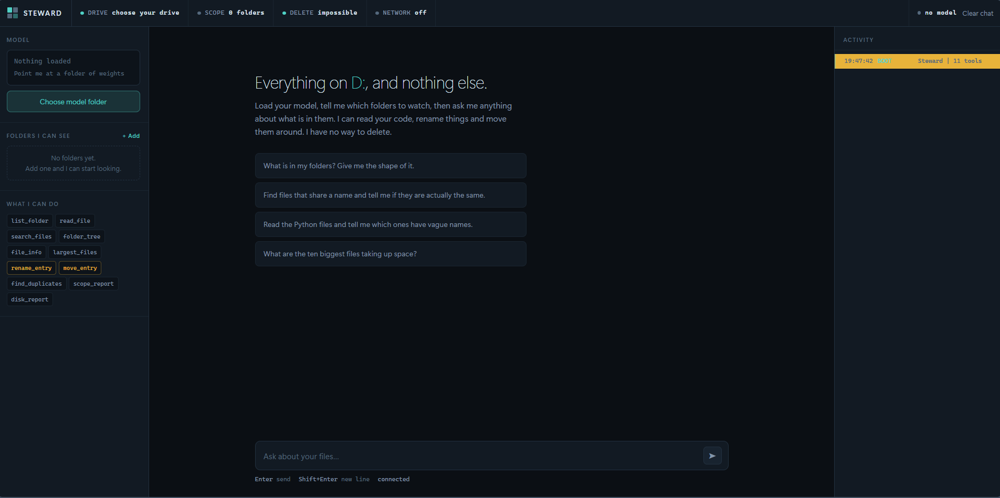

# Steward

A local file assistant. It runs on your machine, reads your code, tells you
what you have, and suggests better names and places for things.

**It cannot delete.** Not "is told not to" — the capability does not exist in the code, and it checks its own source at boot to prove it.

```
start.bat        <- double click this
```

---

## What it does

| | |
|---|---|
| **Sees** | Only `Choose your dir`, and only the folders you add in the sidebar |
| **Reads** | Text and code files, so it can judge what a file actually is |
| **Finds** | Files sharing a name — and tells you if they're identical copies or different code that collided |
| **Renames** | After you click Confirm |
| **Moves** | After you click Confirm |
| **Deletes** | Never. No delete tool exists. |
| **Network** | Never. Binds to `127.0.0.1`, makes no outbound calls |

---

## First run

1. Double-click `start.bat`. It builds a private Python environment in `.venv`
   and installs what it needs. This takes a few minutes once — PyTorch is a
   big download. Every run after that is instant.
2. Your browser opens at `http://127.0.0.1:811`.
3. **Choose model folder** — browse to where your weights live. The picker
   tells you when it finds them:
   `✓ Model found here — 2 safetensors shard(s) + config.json`
4. **Add folders** — pick which folders it may look inside. It can see nothing
   until you do this. Add `D:\Projects`, add `D:\Code`, add whatever you want.
5. Ask it something.

---


---

## 📸 Screenshots

### Dashboard Overview

> `screenshots/dashboard.png`


> `screenshots/dashboard1.png`


---


## Which model

It reads the folder you point it at and picks a loader:

| Weights | Loader | Install |
|---|---|---|
| `*.safetensors` | transformers | already installed |
| `*.gguf` | llama.cpp | `pip install llama-cpp-python` |

**Llama 3.2 3B Instruct works**, and it's what you already have. Be aware
of what 3B means in practice: it's fine at "what's in this folder" and
"read this file", and it gets sloppy at long chains of reasoning. It will
occasionally produce malformed tool calls. The agent recovers from those
(the parser handles fenced JSON, prose wrappers, nested braces, and
improvised argument names), but you'll notice it.

**If you want a real step up:** `Qwen2.5-7B-Instruct` in GGUF at `Q4_K_M` is about 4.7 GB and fits comfortably on your 1070's 8 GB. Qwen2.5 is markedly better at emitting clean JSON tool calls than Llama 3.2 3B, which is the one skill this whole app depends on. `Qwen2.5-Coder-7B-Instruct` is the same size and better at reading code, which is most of what you're asking it to do.

Order I'd try them: Coder-7B GGUF → 7B GGUF → the 3B you have.

Switching is a folder path in the sidebar. No code changes.

**GPU:** `start.bat` installs CPU-only PyTorch, because that always works.
If you want your 1070 doing the work, run `use-gpu.bat` once afterwards. A
3B model at fp16 is about 6 GB, so it fits.

---

## Frankenstein: how to extend it

The whole point of the layout is that new abilities are cheap.

### Add a tool

Drop a file in `core/tools/`. That's the entire process.

```python
# core/tools/mine.py
from ..registry import tool
from .. import sandbox

@tool(
    name="count_todos",
    description="Count TODO comments in a file",
    params={"path": "file to check"},
)
def count_todos(path: str) -> dict:
    target = sandbox.resolve(path, must_exist=True)
    text = target.read_text(encoding="utf-8", errors="replace")
    return {"file": target.name, "todos": text.upper().count("TODO")}
```

Restart. It is now live: the registry found it, the system prompt taught the model about it, the sidebar lists it, the audit log records it.

Always route paths through `sandbox.resolve()`. That is the only thing
standing between a tool and the rest of your disk.

### Gate a tool behind Confirm

Add its name to `REQUIRES_CONFIRMATION` in `core/settings.py`. It now returns a proposal to the UI instead of running, and the amber confirmation card appears. Return a dict with `proposal: True` plus `action`, `from`, `to`,
`from_label`, `to_label`, `reason`.

### Change behaviour

`core/settings.py` holds every knob in the app — drive lock, scope
enforcement, read limits, tool-chain depth, temperature, context size, port, which calls the self-check bans. Nothing else needs editing.

### Change the look

The `:root` block at the top of `static/index.html` holds every colour, font and radius. Three colours carry meaning and are never used decoratively:

- `--signal` teal — permitted
- `--amber` — waiting on your confirmation
- `--halt` orange — refused

---

## Layout

```
start.bat            one-click launcher: venv, deps, run
use-gpu.bat          swap in CUDA PyTorch
server.py            FastAPI + WebSocket, all blocking work off the event loop
core/
  settings.py        every knob in the app
  sandbox.py         drive gate + scope gate + overwrite guard
  selfcheck.py       refuses to boot if delete code appears
  registry.py        @tool decorator, auto-discovery
  engine.py          safetensors and GGUF behind one interface
  agent.py           reasoning loop, JSON extraction, confirmations
  audit.py           append-only log
  tools/
    filesystem.py    list, read, search, tree, info, largest
    organize.py      rename, move, duplicate analysis
    system.py        scope and disk reports
static/index.html    the interface
```

---

## How the sandbox works

Every path goes through `sandbox.resolve()` before any filesystem call:

1. **Resolve first.** `..`, symlinks, junctions and short names are collapsed to a real absolute path *before* any check runs. A symlink on `D:` pointing at `C:` resolves to a `C:` path and dies at gate 1.
2. **Drive gate.** Not on `D:` → refused.
3. **Scope gate.** Not inside a folder you added → refused.
4. **Overwrite guard.** Rename and move refuse any destination that already
   exists. An overwrite is a delete wearing a different hat, and this is the difference between "cannot delete" and "cannot delete unless you phrase it as a move".

When a gate fires, the matching segment in the top bar flashes red and the
reason lands in the activity log.

---

## Files it writes

Both land next to `start.bat`:

- `steward_config.json` — your model path and folder list
- `steward_audit.log` — every action, appended, never rotated

---

## When something breaks

| Symptom | Cause |
|---|---|
| "No .safetensors or .gguf in this folder" | You picked the parent. Go one level in, to where `config.json` sits. |
| "No folders are in scope yet" | Add a folder in the sidebar. It genuinely cannot see anything until you do. |
| Answers are slow | CPU. Run `use-gpu.bat`, or move to a Q4 GGUF. |
| It invents tools or mangles JSON | 3B model limits. Try Qwen2.5-7B-Instruct GGUF. |
| Port 811 in use | Change `PORT` in `core/settings.py`. |
| "STEWARD REFUSED TO START" | Something added delete-capable code. It names the file and line. |

